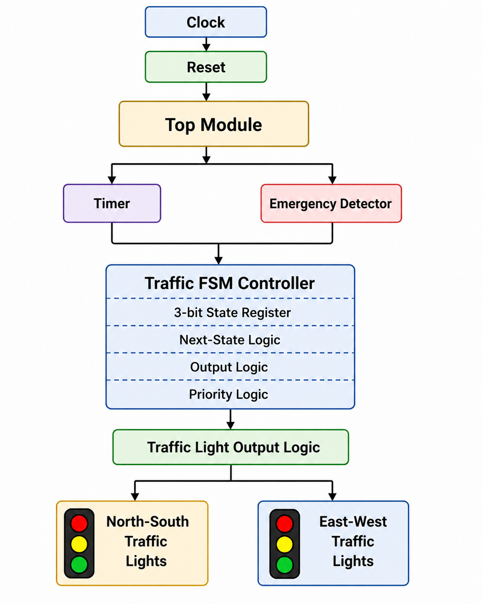
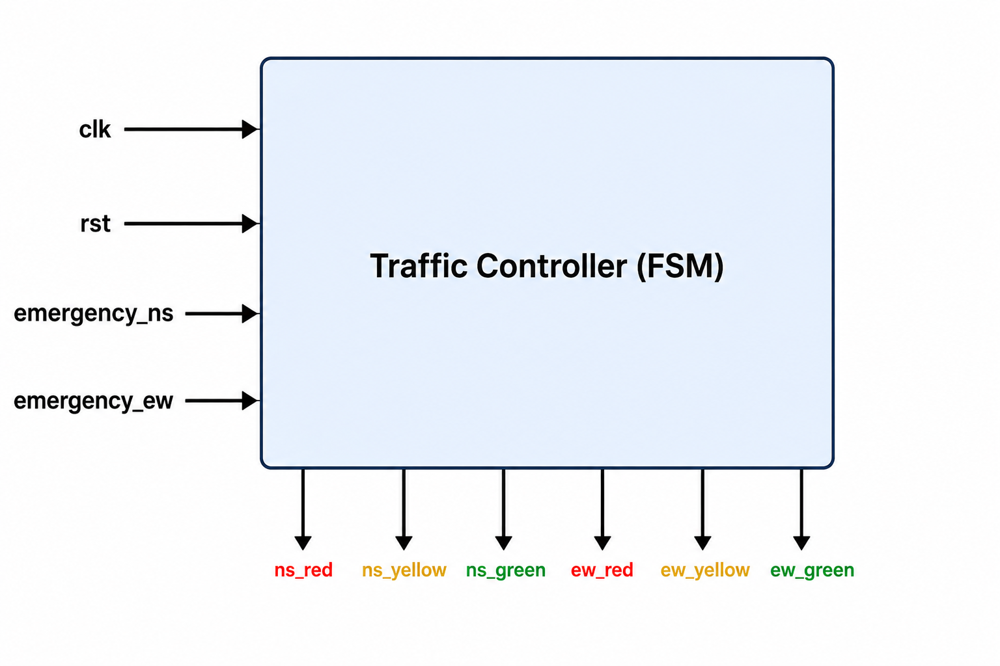
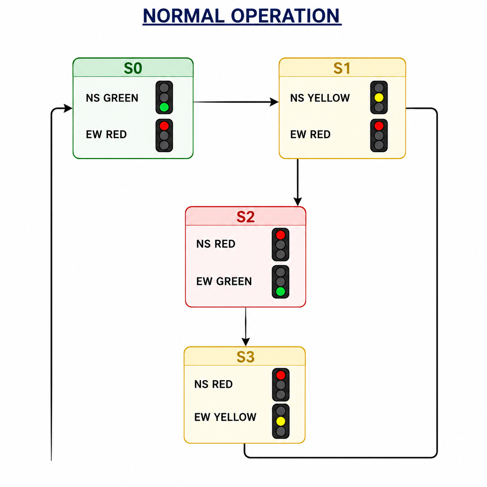
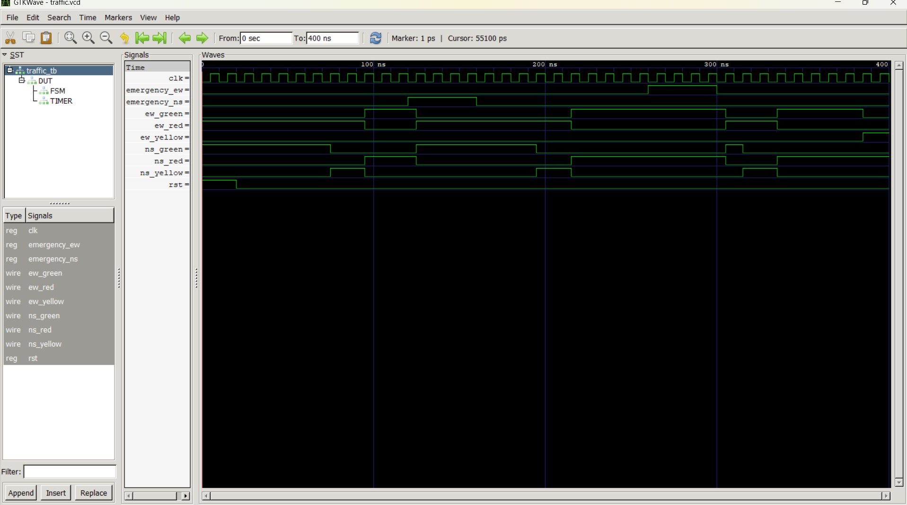

# 🚦 FPGA-Based Traffic Light Controller with Emergency Vehicle Priority


---

## 📖 Project Overview

This project implements a **Finite State Machine (FSM)** based Traffic Light Controller using **Verilog HDL**. The controller manages traffic signals at a four-way intersection while supporting an **Emergency Vehicle Priority System**. When an emergency vehicle is detected on either the North-South or East-West road, the controller immediately grants priority to that direction before safely returning to the normal traffic sequence.

The design follows a modular RTL architecture consisting of a **Traffic FSM**, **Timer Module**, and **Top Module**. Functional verification was performed using **Icarus Verilog**, and waveform analysis was completed using **GTKWave**.

---

## ✨ Features

- FSM-based Traffic Light Controller
- Emergency Vehicle Priority System
- North-South and East-West Traffic Management
- Timer Controlled State Transitions
- Modular Verilog RTL Design
- Functional Verification using Icarus Verilog
- Waveform Analysis using GTKWave
- FPGA Ready Design

---

## 🛠 Tools & Technologies

- Verilog HDL
- Icarus Verilog
- GTKWave
- Visual Studio Code
- Git
- GitHub

---

# 📂 Project Structure

```text
FPGA-Traffic-Light-Controller
│
├── DOCS
│   ├── Project Requirements.docx
│   ├── Block Diagram.docx
│   ├── FSM State Diagram.docx
│   ├── State Encoding Table.docx
│   ├── State Transition Table.docx
│   ├── Output Table.docx
│   └── System Architecture.docx
│
├── IMAGES
│   ├── architecture.png
│   ├── block_diagram.png
│   ├── fsm_diagram.png
│   └── waveform.png
│
├── RTL
│   ├── traffic_fsm.v
│   ├── timer.v
│   └── top.v
│
├── TB
│   └── traffic_tb.v
│
├── WAVEFORMS
│   └── traffic.vcd
│
├── README.md
├── LICENSE
└── .gitignore
```

---

# 🏗 System Architecture



---

# 📊 Block Diagram



---

# 🔄 FSM State Diagram



---

# 🚦 FSM States

| State | Description |
|-------|-------------|
| S0 | North-South Green |
| S1 | North-South Yellow |
| S2 | East-West Green |
| S3 | East-West Yellow |
| S4 | North-South Emergency |
| S5 | East-West Emergency |

---

# 📥 Inputs

| Signal | Description |
|---------|-------------|
| clk | System Clock |
| rst | Active High Reset |
| emergency_ns | Emergency Vehicle Detection (North-South) |
| emergency_ew | Emergency Vehicle Detection (East-West) |

---

# 📤 Outputs

| Signal | Description |
|---------|-------------|
| ns_red | North-South Red |
| ns_yellow | North-South Yellow |
| ns_green | North-South Green |
| ew_red | East-West Red |
| ew_yellow | East-West Yellow |
| ew_green | East-West Green |

---

# ⚙ RTL Modules

### Top Module
Connects all modules and interfaces the FSM with the timer.

### Traffic FSM
Controls traffic light sequencing and emergency vehicle priority logic.

### Timer Module
Generates timing intervals and signals when a state transition should occur.

### Testbench
Verifies the complete system using clock, reset, and emergency input stimuli.

---

# ▶ Simulation

### Compile

```bash
iverilog -g2012 -o traffic_sim RTL/traffic_fsm.v RTL/timer.v RTL/top.v TB/traffic_tb.v
```

### Run

```bash
vvp traffic_sim
```

### View Waveform

```bash
gtkwave traffic.vcd
```

---

# 📈 Simulation Results

The simulation successfully verified:

- ✔ Correct FSM state transitions
- ✔ Traffic light sequencing
- ✔ North-South emergency priority
- ✔ East-West emergency priority
- ✔ Safe return to normal operation
- ✔ Correct output signal generation

---

# 📷 Simulation Waveform



---

# 🚀 Future Enhancements

- Pedestrian Crossing Support
- Traffic Density Based Signal Timing
- Adaptive Traffic Controller
- Seven Segment Countdown Timer
- UART Monitoring Interface
- FPGA Implementation on Xilinx/Intel Boards

---

# 🎯 Learning Outcomes

- Finite State Machine (FSM) Design
- Verilog HDL Programming
- RTL Design Methodology
- Sequential & Combinational Logic
- Testbench Development
- Functional Verification
- Waveform Analysis using GTKWave
- FPGA Design Flow

---

# 👨‍💻 Author

**Seela Rupesh**

**B.Tech – Electronics and Communication Engineering**

GitHub: https://github.com/SEELARUPESH

---

## ⭐ If you found this project helpful, please consider giving it a Star!
